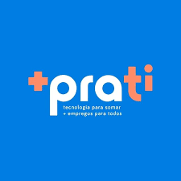
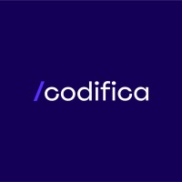

# 🧭 Trilha Dev. Full Stack 2025 - +praTi & Codifica

Repositório dedicado ao acompanhamento da **Trilha de Desenvolvimento Full Stack**, uma iniciativa da **+praTi** e **Codifica** para formar profissionais capacitados e prontos para o mercado de TI.

<p align="center">
  
 
  
</p>

---

## 📘 Sobre o Curso

A **Trilha Dev. Full Stack Jr. 2025** é um programa de formação **intensiva e gratuita**, idealizado pela iniciativa social **+praTi** em parceria com a **Codifica**, uma Edtech especializada em tecnologia.

O curso visa capacitar profissionais desenvolvedores de software com **visão crítica, criativa e resolutiva**, preparados para solucionar desafios do mundo moderno.

- **+praTi:** Iniciativa que busca reduzir o gap entre vagas de TI e profissionais qualificados.
- **Codifica:** Edtech focada em tecnologia e inovação, do ensino básico ao profissional.

### 🎯 Objetivo

Formar desenvolvedores de software capazes de resolver problemas computacionais e criar soluções inovadoras com apoio de empresas parceiras.

---

## 🚀 Tecnologias Utilizadas

<p align="center">
  
</p>

### 🛠️ Ferramentas Auxiliares

<p align="center">
  
</p>

---

## 📁 Estrutura do Repositório

```bash
.
├── modulos
│   ├── atividades
│   │   ├── exercicio1.js
```

Exemplo:

```bash
.
├── Modulo 1 - Introdução à Ciência da Computação
│   ├── Atividade 1 - Estudando as estruturas básicas
│   │   ├── classificacao-idade.js
```

---

## 💼 Projetos

| Nome do Projeto | Visite o Projeto | Repositório no GitHub | Data     |
| --------------- | ---------------- | --------------------- | -------- |
| Em breve        | [Clique aqui](#) | [Repositório](#)      | --/--/-- |
